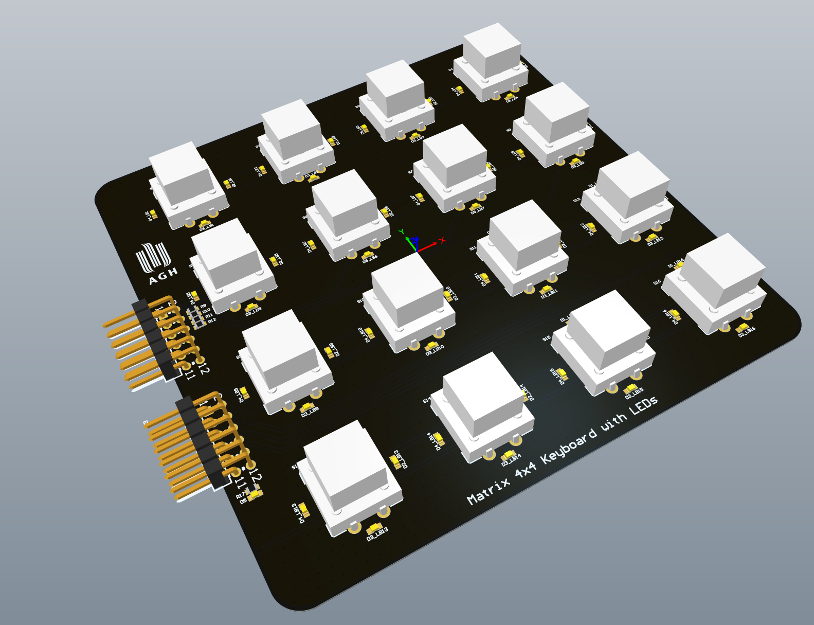

# Klawiatura matrycowa 4x4 z podświetleniem LED

## Założenia projektu:
- Kompatybilność z Digilent Nexys 4 DDR
- Każdy przycisk podświetlany przez 4 diody led 0603
- Przewidziane miejsce na rezystory 0603 pull-up / pull-down
- Switche 12x12 [mm]